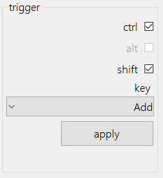

# Url Quick Short

Url shortening where it's convenient.

## What is Url Quick Short

Most url shortening sites have browser plugins that are able to shorten urls for you which is nice. What happens though if you in a browser that doesn't have the plugin or what happens if you copy the url from your browser, close the browser and now want to use that link in another app like maybe on social media or an email but still want to track clicks on the url. Well traditionally you would now open your browser, paste in the link and then click on the handy url shorten plugin to get a short link and then go back to where you were to paste in that link.

With Url Shorten you can use a shortcut key to automatically shorten links that are in your clipboard. By doing this you lose less context of what you were doing. Because Url Quick Short parses your clipboard it will detect multiple urls as shorten all of them for you instead of you needing to replace them one by one. 

## How it works 

### Providers

At this point in time only bitly is supported.

### Authentication

Each authentication provider dictates which fields are shown for authentication so that we are able to easily integrate any shortening services.

#### Bitly

For bitly you are currently required to enter a username and password for the bitly service. We use this username and password once off to get a access token from bitly

After clicking try authenticate you should see a nice *Authentication successful!* message and then you should be ready to go.

### Trigger Keys

We currently support pressing shift, ctrl and any other key that is in the drop list (this covers 0-9, A-Z and a couple symbols that makes sense)

after clicking apply these settings will be registered with the key capturing utility.

### Making with the Magics

So once you have configured everything you are able to press that key combination and we'll attempt to shorten every link that's in your clipboard. For example say you had the text below in your clipboard
	
	How Old .net
	http://how-old.net/
	
	Gordon Beeming's Blog
	https://gordonbeeming.xyz/
	
	Bing
	https://www.bing.com
	
	Some other random text 

After you press your key combination (in my case that was *ctrl & shift & +*) and wait a couple milliseconds'ish and now paste from you clipboard you should see all the links have been shortened

	How Old .net
	https://go.beeming.net/1J4K9Ej
	
	Gordon Beeming's Blog
	https://go.beeming.net/3h1uvRW
	
	Bing
	https://go.beeming.net/1g5ZoEL
	
	Some other random text  

and just like that you have all shortened urls (unless in this case bitly says that's already a bitly link, in that case the link will be unchanged).

## Want to integrate?

Integrating a new url shortening service is really simple, you can take a look at the bitly implementation in [BitlyPlugin.cs](https://github.com/Gordon-Beeming/Url-Quick-Short/blob/main/Url%20Quick%20Short.Integrate.Bitly/BitlyPlugin.cs).
